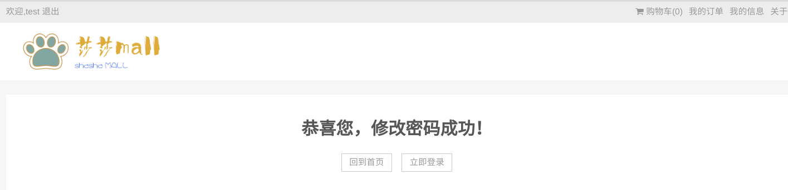
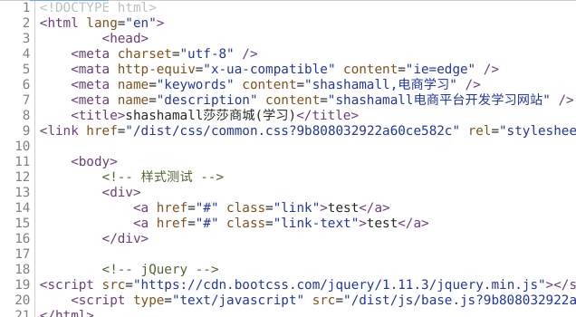
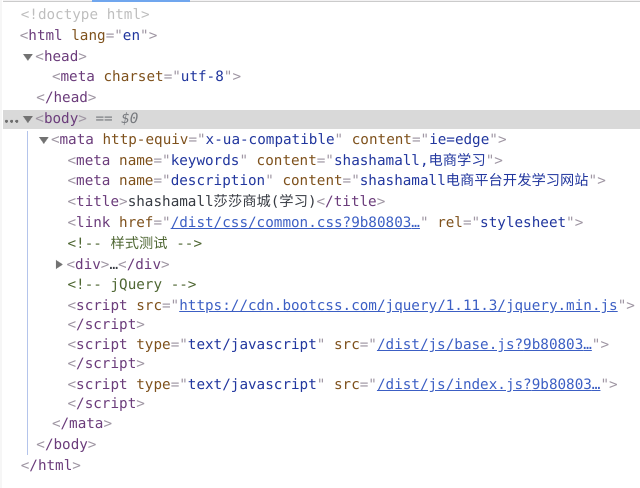
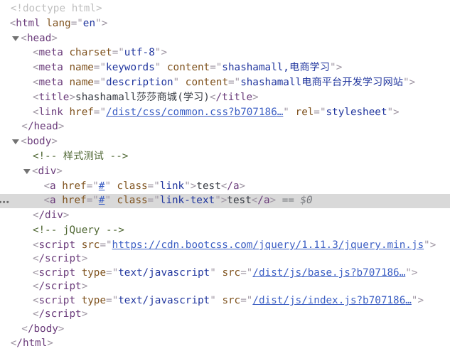
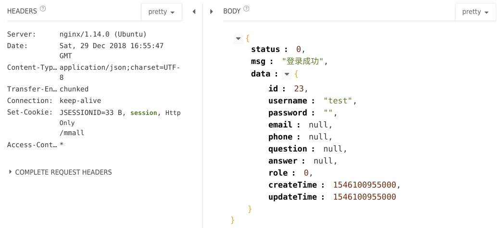

### shashamall-fe项目介绍
#### 1. 项目介绍
&nbsp;&nbsp;&nbsp;&nbsp;&nbsp;&nbsp;该项目是本人练手的项目，慕课网从零打造商城的前端项目项目的一些学习心得会在这里更新，想了下就当做学习笔记吧，同时在学习过程中遇到坑也会在此文档更新，你也可以在[我的博客](https://www.cnblogs.com/linkzz/ "linkzz的博客")浏览学习笔记。
#### 2. 传送门
- [*心得*](# 心得)
- [*技巧*](# 技巧)
- *修改的地方*
- *踩坑记录*
#### 3. 心得
1. **取非符号的妙用**</br>
    如下代码块：
```javascript
    // 字段的验证，支持是否非空、是否是手机号、是否是邮箱地址的判断
    validate : function(value, type){
        //需要把前后的空格去掉
        var value = $.trim(value);
        // 非空判断
        if ('require' === type){
            // 这里可以将value转换成boolean型
            return !!value;
        }
    }
```
&nbsp;&nbsp;&nbsp;&nbsp;&nbsp;&nbsp;&nbsp;经过测试在js中`!null`、`!undefined`、`!''`输出结果都为`true`，而任意非空字符串取非均为`false`。代码中巧妙的利用了这点，先用jquery把传入的参数去掉空格，同时转换成字符串，再进行二次取非操作，这样传入的空字符就会返回boolean型的`true`,这样函数的返回值也更容易理解，当传入的是空串时返回`true`。

#### 4. 技巧
#### 5. 一些修改
1. 用户模块登录状态**修改密码**功能更新<br><br>
原本在请求接口更新密码成功后回调函数中只是做了一个提示，但是我在此处测试了一下，发现如果更新密码成功之后跳转到`result`页好点，可是跳转了之后发现这是导航栏的登录状态还存在，如下图：<br>
 <br>
于是在代码上作一下修改，在修改密码请求成功后，先主动调用logout接口登出，这样看起来就不是那么违和了：
```javascript
if (validataResult.status){
    // 字段是有效的,开始请求接口
    _user.updatePassword({
        passwordOld : userInfo.password,
        passwordNew : userInfo.passwordNew
    }, function(res, msg){
        // 修改成功后需先登出
        _user.logout();
        // 跳转操作结果页
        window.location.href = './result.html?type=pass-update';
    }, function(errMsg){
        _util.errorTips(errMsg);
    });
} else {
    // 字段是无效的,无效提示保存在validataResult中
    _util.errorTips(validataResult.msg);
}
```


#### 6. 踩坑记录
- **html模板渲染工具**hogan**的引用报错**<br/><br/>
    执行 `npm install hogan --save` 将hogen作为项目生产环境依赖安装之后 `require('hogan')` 之后打包报错: `Cannot resolve module 'hogan'` ，查阅资料之后发现是引用位置变更了，新版本的hogen模块是在node_modules下的hogan.js中，故重新引入 `require('hogan.js')` 之后打包成功。<br><br>
- **`<mata http-equiv="x-ua-compatible" content="ie=edge" />`让网页元素检查时`meta`标签跑到`body`标签当中**<br/><br/>
    使用了`<mata http-equiv="x-ua-compatible" content="ie=edge" />`标签之后发现网页元素检查时`meta`标签错位了，本该包含在`head`标签内的`meta`标签跑到了`body`标签中，目前原因尚不知晓（原谅我是个前端菜鸟 ^_^），删去该行内容后正常。<br>
    源代码显示正常:<br>
    <br>
    meta标签表现错位:<br>
    <br>
    修改后显示正常:<br>
    <br>
    <br>
- **nginx代理导致session丢失？**<br><br>
        在测试后端接口的过程中发现系统不能记录我的登录状态，每次登录之后再调用查询用户信息的接口返回的结果都是用户未登录。后端的登录接口如下：<br>
```java
    @RequestMapping(value = "login.do", method = RequestMethod.POST)
    @ResponseBody
    public ServerResponse<User> login(String username, String password, HttpSession session){
        ServerResponse<User> response = iUserService.login(username, password);
        if (response.isSuccess()){
            //登录成功，将user存入session中
            session.setAttribute(Const.CURRENT_USER, response.getData());
        }
        return response;
    }
```
获取用户信息接口如下：<br>
```java
    @RequestMapping(value = "get_user_info.do", method = RequestMethod.POST)
    @ResponseBody
    public ServerResponse<User> getUserInfo(HttpSession session){
        User user = (User) session.getAttribute(Const.CURRENT_USER);
        if (null == user){
            return ServerResponse.createByErrorMessage("用户未登陆，无法获取当前用户信息");
        }
        return ServerResponse.createBySuccess("获取成功", user);
    }
```
可见用户的信息是存在session中的，而使用restlet测试接口的时候发现了蹊跷：

在访问接口的时候每次服务器都会设置新的`session`,在JavaWeb中我们知道：
>在浏览器第一次访问`servlet`时，`servlet`会生成一个`sessionId`，这个`sessionId`会被保存到客户端的会话`cookie`中，当浏览器再次访问的时候会携带`cookie`，而`cookie`中就保存着这个`sessionId`，这是服务器会根据`sessionId`取出对应的会话`session`,tomcat服务器生成的`sessionId`叫`JSESSIONID`。<br>

那么访问接口出现session消失的原因肯定就出在nginx代理配置中，果然查阅资料发现：
>`location`后的路径和代理的路径不一致就会产生session丢失的问题，需要在配置中加上`proxy_cookie_path`配置方可保持`session`。
nginx作如下配置：<br>

```nginx
    server {
            listen 80;
            autoindex on;
            server_name www.shashamall.com;
            access_log /usr/local/nginx/logs/access.log combined;
            index index.html index.htm index.jsp index.php;
            #error_page 404 /404.html;
            if ( $query_string ~* ".*[\;'\<\>].*" ){
                    return 404;
            }
            location / {
                    proxy_pass http://127.0.0.1:8088/mmall/;
                    mejpegjproxy_cookie_path /mmall /;            //问题所在
                    add_header Access-Control-Allow-Origin *;
            }
    }
```
- **使用Hogan渲染html模板加载图片出错**<br>
在从服务器加载数据并渲染商品列表的时候出现`Cannot find module "./{{imageHost}}{{mainImage}}"`错误，查看返回的json字段信息如下:<br>
```json
{
    "status": 0,
    "data": {
        "pageNum": 1,
        "pageSize": 10,
        "size": 1,
        "orderBy": "price asc",
        "startRow": 1,
        "endRow": 1,
        "total": 1,
        "pages": 1,
        "list": [
            {
                "id": 26,
                "categoryId": 100002,
                "name": "Apple iPhone 7 Plus (A1661) 128G 玫瑰金色 移动联通电信4G手机",
                "subtitle": "iPhone 7，现更以红色呈现。",
                "mainImage": "241997c4-9e62-4824-b7f0-7425c3c28917.jpeg",
                "price": 6999,
                "status": 1,
                "imageHost": "//img.shashamall.com/"
            }
        ],
        "firstPage": 1,
        "prePage": 0,
        "nextPage": 0,
        "lastPage": 1,
        "isFirstPage": true,
        "isLastPage": true,
        "hasPreviousPage": false,
        "hasNextPage": false,
        "navigatePages": 8,
        "navigatepageNums": [
            1
        ]
    }
}
```
HTML模板的string文件如下：<br>
```html
{{#list}}
    <li class="p-item">
        <div class="p-img-con">
            <a href="./detail.html?productId={{id}}" target="_blank" class="link">
                
            </a>
        </div>
        <div class="p-price-con">
            <span class="p-price">￥{{price}}</span>
        </div>
        <div class="p-name-con">
            <a href="./detail.html?productId={{id}}" target="_blank" class="p-name">{{name}}</a>
        </div>
    </li>
{{/list}}
```
页面传参如下：<br>
```js
// 调用service层
_product.getProducts(listParam, function(res){
    listHtml = _util.renderHtml(templateIndex, {
        list : res.list
    });
    // 将渲染成功的html放入容器
    $('.p-list-con').html(listHtml);
    // 渲染分页信息
    _this.loadPagination(res.pageNum, res.pages);
}, function(errMsg){
    // 错误提示
    _util.errorTips(errMsg);
});
```
按道理`img`标签的`src`属性应该会解析成`//img.shashamall.com/241997c4-9e62-4824-b7f0-7425c3c28917.jpeg`，然后这里浏览器解析的时候应该会加上`http`从而获取图片资源的，可是这里却报错。多番尝试之后在模板src前添加"`/`"符号解决问题，目前原因并不知道，这里先记录这个错误，后续再查阅资料，也希望知道的大神告知，解我疑惑！
>解决方法：
改``为``
- **后台管理系统无法预览**
在后台管理系统的代码下载并按照README.md文件执行安装后打开发现console报错: `Simditor.connect is not a function`，检查数遍之后才发现是simditor没安装好，执行`npm install simditor@2.3.6 --save`之后成功解决。


